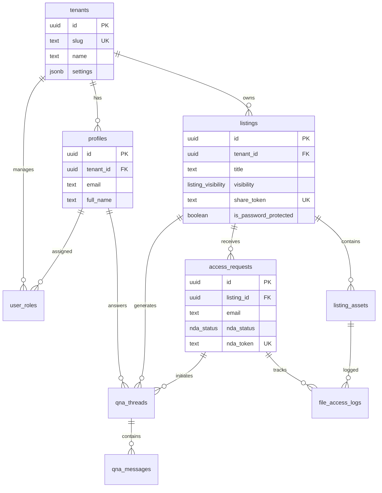

# Data Model & ERD

## Core Entities

### Multi-Tenant Foundation

```sql
-- Enum types
CREATE TYPE app_role AS ENUM ('admin', 'editor', 'reviewer', 'buyer');
CREATE TYPE listing_visibility AS ENUM ('public', 'private', 'unlisted');
CREATE TYPE listing_status AS ENUM ('active', 'pending', 'sold', 'archived');
CREATE TYPE nda_status AS ENUM ('pending', 'signed', 'declined', 'expired');
CREATE TYPE asset_type AS ENUM ('public', 'nda_required', 'confidential');

-- Core tables
CREATE TABLE tenants (
  id UUID PRIMARY KEY DEFAULT gen_random_uuid(),
  slug TEXT UNIQUE NOT NULL, -- 'sherwood', used in embed tenant="..."
  name TEXT NOT NULL,
  domain TEXT, -- verified domain for SSO/CORS
  settings JSONB DEFAULT '{}', -- marketplace_enabled, theme, etc.
  stripe_customer_id TEXT,
  created_at TIMESTAMPTZ DEFAULT NOW(),
  updated_at TIMESTAMPTZ DEFAULT NOW()
);

CREATE TABLE profiles (
  id UUID PRIMARY KEY REFERENCES auth.users(id) ON DELETE CASCADE,
  tenant_id UUID REFERENCES tenants(id) ON DELETE CASCADE,
  email TEXT NOT NULL,
  full_name TEXT,
  avatar_url TEXT,
  created_at TIMESTAMPTZ DEFAULT NOW(),
  UNIQUE(tenant_id, email)
);

CREATE TABLE user_roles (
  id UUID PRIMARY KEY DEFAULT gen_random_uuid(),
  user_id UUID REFERENCES profiles(id) ON DELETE CASCADE,
  tenant_id UUID REFERENCES tenants(id) ON DELETE CASCADE,
  role app_role NOT NULL,
  created_at TIMESTAMPTZ DEFAULT NOW(),
  UNIQUE(user_id, tenant_id, role)
);

-- Security definer function for role checks (avoids RLS recursion)
CREATE OR REPLACE FUNCTION has_role(_user_id UUID, _tenant_id UUID, _role app_role)
RETURNS BOOLEAN
LANGUAGE SQL
STABLE
SECURITY DEFINER
SET search_path = public
AS $$
  SELECT EXISTS (
    SELECT 1 FROM user_roles
    WHERE user_id = _user_id
      AND tenant_id = _tenant_id
      AND role = _role
  )
$$;
```

### Listings & Assets

```sql
CREATE TABLE listings (
  id UUID PRIMARY KEY DEFAULT gen_random_uuid(),
  tenant_id UUID REFERENCES tenants(id) ON DELETE CASCADE,
  
  -- Basic info
  title TEXT NOT NULL,
  slug TEXT NOT NULL, -- URL-friendly
  industry TEXT,
  location TEXT,
  description TEXT,
  
  -- Financial
  revenue NUMERIC(15,2),
  ebitda NUMERIC(15,2),
  asking_price NUMERIC(15,2),
  
  -- Visibility
  visibility listing_visibility DEFAULT 'unlisted',
  status listing_status DEFAULT 'pending',
  share_token TEXT UNIQUE, -- for private link sharing
  is_password_protected BOOLEAN DEFAULT FALSE,
  password_hash TEXT, -- bcrypt if set
  
  -- SEO
  is_searchable BOOLEAN DEFAULT TRUE, -- robots meta
  meta_title TEXT,
  meta_description TEXT,
  
  -- Timestamps
  published_at TIMESTAMPTZ,
  created_at TIMESTAMPTZ DEFAULT NOW(),
  updated_at TIMESTAMPTZ DEFAULT NOW(),
  
  UNIQUE(tenant_id, slug)
);

CREATE INDEX idx_listings_tenant_visibility ON listings(tenant_id, visibility, status);
CREATE INDEX idx_listings_share_token ON listings(share_token) WHERE share_token IS NOT NULL;

CREATE TABLE listing_assets (
  id UUID PRIMARY KEY DEFAULT gen_random_uuid(),
  listing_id UUID REFERENCES listings(id) ON DELETE CASCADE,
  tenant_id UUID REFERENCES tenants(id) ON DELETE CASCADE,
  
  filename TEXT NOT NULL,
  file_size BIGINT,
  mime_type TEXT,
  storage_path TEXT NOT NULL, -- S3 key
  
  asset_type asset_type DEFAULT 'public',
  display_order INTEGER DEFAULT 0,
  
  created_at TIMESTAMPTZ DEFAULT NOW(),
  created_by UUID REFERENCES profiles(id)
);

CREATE INDEX idx_assets_listing ON listing_assets(listing_id, asset_type);
```

### NDA & Access Control

```sql
CREATE TABLE access_requests (
  id UUID PRIMARY KEY DEFAULT gen_random_uuid(),
  listing_id UUID REFERENCES listings(id) ON DELETE CASCADE,
  tenant_id UUID REFERENCES tenants(id) ON DELETE CASCADE,
  
  -- Buyer info
  email TEXT NOT NULL,
  full_name TEXT,
  company TEXT,
  phone TEXT,
  
  -- NDA flow
  nda_status nda_status DEFAULT 'pending',
  nda_signed_at TIMESTAMPTZ,
  nda_signature_data JSONB, -- IP, user-agent, e-signature
  nda_token TEXT UNIQUE, -- JWT for file access
  nda_expires_at TIMESTAMPTZ,
  
  -- Magic link for passwordless
  magic_token TEXT UNIQUE,
  magic_expires_at TIMESTAMPTZ,
  
  created_at TIMESTAMPTZ DEFAULT NOW(),
  updated_at TIMESTAMPTZ DEFAULT NOW()
);

CREATE INDEX idx_access_listing_email ON access_requests(listing_id, email);
CREATE INDEX idx_access_nda_token ON access_requests(nda_token) WHERE nda_token IS NOT NULL;

CREATE TABLE file_access_logs (
  id UUID PRIMARY KEY DEFAULT gen_random_uuid(),
  asset_id UUID REFERENCES listing_assets(id) ON DELETE CASCADE,
  access_request_id UUID REFERENCES access_requests(id),
  tenant_id UUID REFERENCES tenants(id) ON DELETE CASCADE,
  
  action TEXT NOT NULL, -- 'view', 'download'
  ip_address INET,
  user_agent TEXT,
  watermark_data JSONB, -- embedded email, timestamp
  
  created_at TIMESTAMPTZ DEFAULT NOW()
);
```

### Q&A System

```sql
CREATE TABLE qna_threads (
  id UUID PRIMARY KEY DEFAULT gen_random_uuid(),
  listing_id UUID REFERENCES listings(id) ON DELETE CASCADE,
  tenant_id UUID REFERENCES tenants(id) ON DELETE CASCADE,
  access_request_id UUID REFERENCES access_requests(id),
  
  question TEXT NOT NULL,
  answer TEXT,
  
  is_public BOOLEAN DEFAULT FALSE, -- show in public FAQ
  answered_at TIMESTAMPTZ,
  answered_by UUID REFERENCES profiles(id),
  
  created_at TIMESTAMPTZ DEFAULT NOW(),
  updated_at TIMESTAMPTZ DEFAULT NOW()
);

CREATE INDEX idx_qna_listing ON qna_threads(listing_id, is_public);

CREATE TABLE qna_messages (
  id UUID PRIMARY KEY DEFAULT gen_random_uuid(),
  thread_id UUID REFERENCES qna_threads(id) ON DELETE CASCADE,
  tenant_id UUID REFERENCES tenants(id) ON DELETE CASCADE,
  
  sender_id UUID REFERENCES profiles(id),
  sender_email TEXT, -- for buyers without account
  message TEXT NOT NULL,
  
  created_at TIMESTAMPTZ DEFAULT NOW()
);
```

### Audit & Events

```sql
CREATE TABLE audit_events (
  id UUID PRIMARY KEY DEFAULT gen_random_uuid(),
  tenant_id UUID REFERENCES tenants(id) ON DELETE CASCADE,
  listing_id UUID REFERENCES listings(id),
  
  event_type TEXT NOT NULL, -- 'listing_viewed', 'nda_signed', 'file_downloaded'
  actor_id UUID REFERENCES profiles(id),
  actor_email TEXT, -- for anonymous buyers
  
  metadata JSONB, -- flexible payload
  ip_address INET,
  user_agent TEXT,
  
  created_at TIMESTAMPTZ DEFAULT NOW()
);

CREATE INDEX idx_audit_tenant_type ON audit_events(tenant_id, event_type, created_at DESC);
CREATE INDEX idx_audit_listing ON audit_events(listing_id, created_at DESC);
```

## ERD Diagram (Mermaid)



## RLS Policies (Example)

```sql
-- Listings: public if visible, owner always sees, or valid share token
ALTER TABLE listings ENABLE ROW LEVEL SECURITY;

CREATE POLICY "Public listings readable by all"
  ON listings FOR SELECT
  USING (
    visibility = 'public' AND status = 'active'
  );

CREATE POLICY "Tenant admins see all listings"
  ON listings FOR ALL
  TO authenticated
  USING (
    has_role(auth.uid(), tenant_id, 'admin')
  );

CREATE POLICY "Private listings via share token"
  ON listings FOR SELECT
  USING (
    visibility = 'private' 
    AND share_token = current_setting('request.jwt.claims', true)::json->>'share_token'
  );

-- Assets: public always, confidential only with valid NDA token
ALTER TABLE listing_assets ENABLE ROW LEVEL SECURITY;

CREATE POLICY "Public assets readable"
  ON listing_assets FOR SELECT
  USING (asset_type = 'public');

CREATE POLICY "Confidential assets require NDA"
  ON listing_assets FOR SELECT
  TO authenticated
  USING (
    asset_type IN ('nda_required', 'confidential')
    AND EXISTS (
      SELECT 1 FROM access_requests ar
      WHERE ar.listing_id = listing_assets.listing_id
        AND ar.nda_status = 'signed'
        AND ar.nda_expires_at > NOW()
        AND ar.email = (SELECT email FROM profiles WHERE id = auth.uid())
    )
  );
```

## Indexes for Performance

```sql
-- Multi-tenant queries
CREATE INDEX idx_profiles_tenant ON profiles(tenant_id);
CREATE INDEX idx_listings_tenant_status ON listings(tenant_id, status) WHERE visibility = 'public';

-- Search optimization
CREATE INDEX idx_listings_search ON listings USING gin(to_tsvector('english', title || ' ' || COALESCE(description, '')));

-- Audit queries
CREATE INDEX idx_audit_created ON audit_events(created_at DESC);
```
