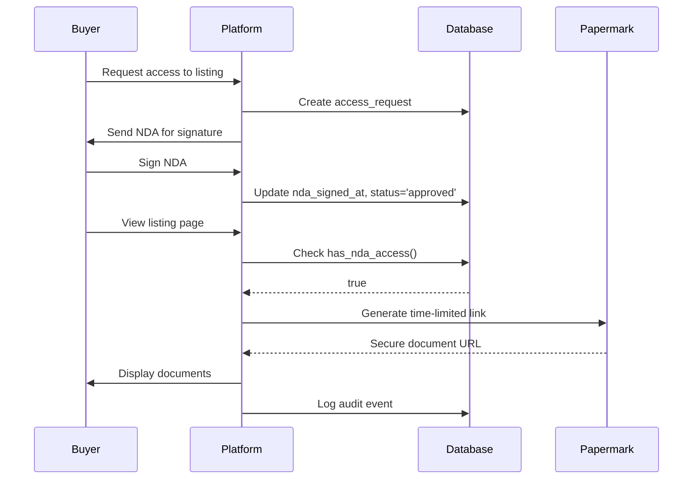

# Papermark Integration Guide

## Overview

This document outlines the integration approach between the M&A Platform and [Papermark](https://github.com/mfts/papermark), an open-source document-sharing platform for secure data rooms.

## Architecture

### Current Implementation (Phase 1)
The platform uses **Lovable Cloud (Supabase) Storage** for confidential document storage with:
- Row-Level Security (RLS) policies
- NDA-gated access control
- Audit logging for all file access
- Signed, time-limited URLs for downloads

### Future Integration (Phase 2)
Papermark integration will provide:
- Advanced document analytics (page-by-page tracking)
- Watermarking capabilities
- Custom branding for data rooms
- Enhanced visitor tracking

## Data Model

### Current Tables

```sql
-- listing_assets: Stores file metadata
CREATE TABLE public.listing_assets (
  id UUID PRIMARY KEY,
  listing_id UUID REFERENCES listings(id),
  filename TEXT,
  storage_path TEXT,           -- Supabase Storage path OR Papermark URL
  size_bytes BIGINT,
  mime_type TEXT,
  asset_type TEXT,             -- 'public' or 'confidential'
  uploaded_by UUID,
  papermark_link_id TEXT,      -- Future: Papermark document ID
  created_at TIMESTAMPTZ
);

-- access_requests: NDA workflow
CREATE TABLE public.access_requests (
  id UUID PRIMARY KEY,
  listing_id UUID,
  email TEXT,
  full_name TEXT,
  company TEXT,
  status TEXT,                 -- 'pending', 'approved', 'rejected'
  nda_signed_at TIMESTAMPTZ,
  access_token TEXT,           -- JWT for accessing confidential docs
  expires_at TIMESTAMPTZ,
  created_at TIMESTAMPTZ
);

-- audit_events: Track all document access
CREATE TABLE public.audit_events (
  id UUID PRIMARY KEY,
  listing_id UUID,
  user_id UUID,
  event_type TEXT,             -- 'file_viewed', 'file_downloaded', 'nda_signed'
  metadata JSONB,
  ip_address INET,
  user_agent TEXT,
  created_at TIMESTAMPTZ
);
```

## Integration Approaches

### Option 1: Hybrid Storage (Recommended)
- **Public assets**: Stored in Supabase Storage (teasers, thumbnails)
- **Confidential docs**: Papermark links stored in `listing_assets.papermark_link_id`
- **Benefits**: Leverage Papermark's analytics while keeping simple files in Supabase

#### Implementation:
```typescript
// When uploading confidential documents
const uploadConfidentialDoc = async (file: File, listingId: string) => {
  // Create Papermark document link
  const papermarkResponse = await fetch('https://api.papermark.io/documents', {
    method: 'POST',
    headers: { 
      'Authorization': `Bearer ${PAPERMARK_API_KEY}`,
      'Content-Type': 'application/json'
    },
    body: JSON.stringify({
      name: file.name,
      file: await fileToBase64(file), // or upload to Papermark's storage
      allowDownload: true,
      expiresAt: null,
      emailProtected: true, // Require email verification
      // ... other Papermark options
    })
  });

  const { id: papermarkLinkId, shortLink } = await papermarkResponse.json();

  // Store metadata in our database
  await supabase.from('listing_assets').insert({
    listing_id: listingId,
    filename: file.name,
    storage_path: shortLink, // Papermark URL
    papermark_link_id: papermarkLinkId,
    asset_type: 'confidential',
    size_bytes: file.size,
    mime_type: file.type
  });
};
```

### Option 2: Self-Hosted Papermark
Deploy Papermark alongside the M&A platform:

```yaml
# docker-compose.yml
services:
  papermark:
    image: mfts/papermark:latest
    environment:
      DATABASE_URL: postgresql://...
      NEXTAUTH_SECRET: ${PAPERMARK_NEXTAUTH_SECRET}
      NEXTAUTH_URL: https://docs.yourdomain.com
    volumes:
      - papermark-uploads:/app/uploads
```

**Benefits**:
- Full control over data
- No external API dependencies
- Custom branding and features

### Option 3: Direct API Integration
Papermark doesn't currently have a public API, so you would need to:
1. Fork the Papermark repository
2. Add API endpoints for document management
3. Deploy your custom fork
4. Integrate via REST API

## Security Flow

### NDA-Gated Access



### Access Control Functions

```sql
-- Check if user has NDA access
CREATE FUNCTION public.has_nda_access(_user_id uuid, _listing_id uuid)
RETURNS boolean AS $$
  SELECT EXISTS (
    SELECT 1 FROM access_requests
    WHERE listing_id = _listing_id
      AND email = (SELECT email FROM auth.users WHERE id = _user_id)
      AND status = 'approved'
      AND nda_signed_at IS NOT NULL
      AND (expires_at IS NULL OR expires_at > now())
  )
$$ LANGUAGE sql SECURITY DEFINER;

-- RLS policy for confidential assets
CREATE POLICY "Confidential assets require NDA"
  ON listing_assets FOR SELECT
  USING (
    asset_type = 'public' 
    OR public.has_role(auth.uid(), 'admin')
    OR public.has_role(auth.uid(), 'editor')
    OR public.has_nda_access(auth.uid(), listing_id)
  );
```

## Papermark Features to Leverage

### 1. Document Analytics
```typescript
// Fetch analytics from Papermark
const getDocumentAnalytics = async (papermarkLinkId: string) => {
  const response = await fetch(
    `https://api.papermark.io/links/${papermarkLinkId}/analytics`,
    {
      headers: { 'Authorization': `Bearer ${PAPERMARK_API_KEY}` }
    }
  );
  
  return response.json();
  // Returns: views, unique visitors, time spent, pages viewed
};
```

### 2. Watermarking
Configure Papermark to add dynamic watermarks:
```typescript
{
  watermark: {
    enabled: true,
    text: `${buyerEmail} | ${buyerIP} | ${timestamp}`,
    opacity: 0.3,
    position: 'diagonal'
  }
}
```

### 3. Custom Domains
Point `docs.yourdomain.com` to Papermark for branded data room experience.

## Migration Plan

### Phase 1 (Current)
- ✅ Use Supabase Storage for all files
- ✅ NDA workflow with access_requests table
- ✅ Audit logging
- ✅ RLS policies for security

### Phase 2 (Papermark Integration)
1. **Add Papermark columns** to listing_assets:
   ```sql
   ALTER TABLE listing_assets 
   ADD COLUMN papermark_link_id TEXT,
   ADD COLUMN papermark_short_link TEXT;
   ```

2. **Create Papermark service wrapper**:
   ```typescript
   // lib/papermark.ts
   export class PapermarkService {
     async uploadDocument(file: File, options: PapermarkUploadOptions) { }
     async getDocumentLink(linkId: string) { }
     async revokeAccess(linkId: string, email: string) { }
     async getAnalytics(linkId: string) { }
   }
   ```

3. **Update file upload flow** to use Papermark for confidential docs

4. **Add analytics dashboard** using Papermark's tracking data

### Phase 3 (Advanced Features)
- Email verification integration
- Custom watermarking templates
- Automated NDA expiration and renewal
- Advanced viewer permissions (download, print, copy controls)

## Development Setup

### Environment Variables
```bash
# .env.local (Papermark integration)
PAPERMARK_API_KEY=pm_xxx
PAPERMARK_TEAM_ID=team_xxx
PAPERMARK_WEBHOOK_SECRET=whsec_xxx

# Self-hosted Papermark
PAPERMARK_BASE_URL=https://docs.yourdomain.com
```

### Webhook Setup
Configure Papermark webhooks to sync events:
```typescript
// supabase/functions/papermark-webhook/index.ts
export default async (req: Request) => {
  const event = await req.json();
  
  switch (event.type) {
    case 'document.viewed':
      // Log to audit_events
      await supabase.from('audit_events').insert({
        listing_id: event.metadata.listing_id,
        event_type: 'file_viewed',
        metadata: event.data
      });
      break;
    
    case 'document.downloaded':
      // Track download
      break;
  }
};
```

## Testing

### Mock Papermark Integration
For development without Papermark:
```typescript
// lib/papermark-mock.ts
export const mockPapermarkService = {
  uploadDocument: async (file: File) => ({
    id: `mock_${Date.now()}`,
    shortLink: `https://mock.papermark.io/d/${Math.random().toString(36)}`
  }),
  // ... other mock methods
};
```

## Resources

- [Papermark GitHub](https://github.com/mfts/papermark)
- [Papermark Documentation](https://www.papermark.io/docs)
- [Self-Hosting Guide](https://github.com/mfts/papermark#self-hosting)
- [Supabase Storage Docs](https://supabase.com/docs/guides/storage)

## Support

For questions about this integration:
1. Check existing implementation in `src/integrations/papermark/`
2. Review Papermark issues on GitHub
3. Contact your dev team for custom requirements
